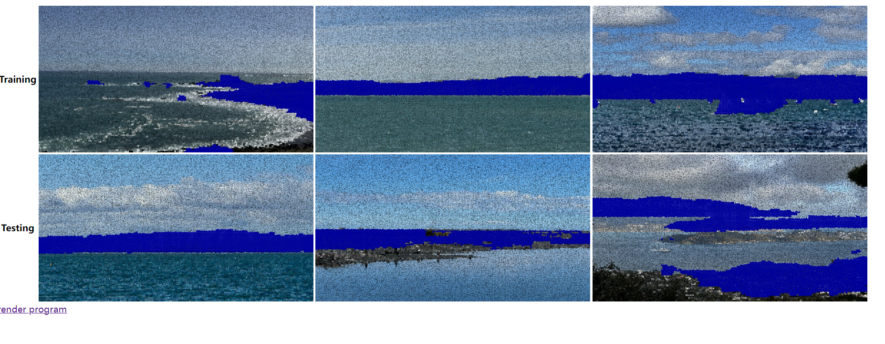
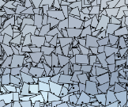
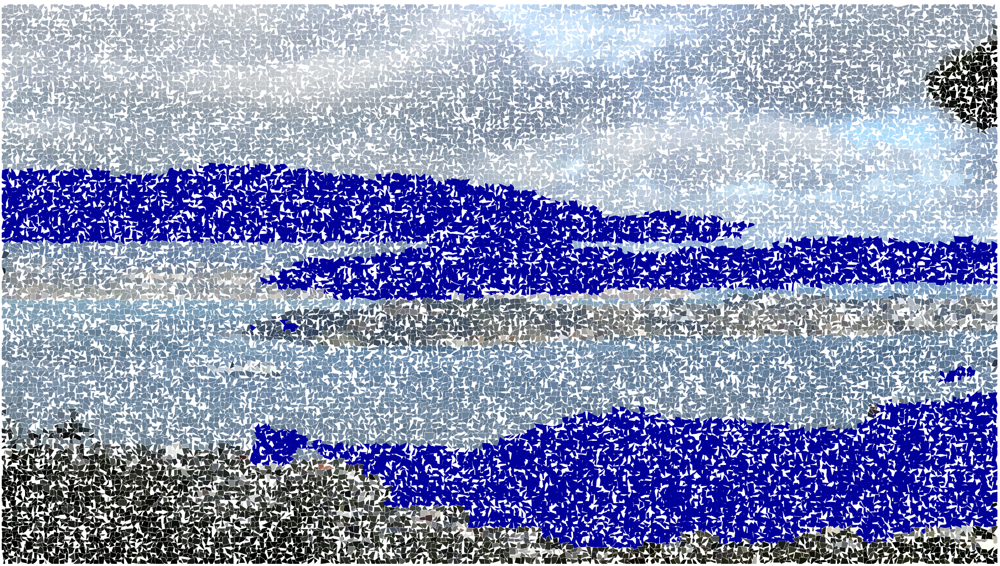

## Creative Coding 2: Custom Pixel

### Project Description

The photographs in this project are all taken by myself, on different seafronts in Wellington.This project explores the journey of exploration from the known (land and mountains) to the unknown (oceans) through innovative image processing techniques. The project utilises JavaScript and the p5.js framework to achieve a unique visual effect by contrasting the pixels that process the input image and the masked image. If the masking pixel is white, the original pixel colour is displayed; if it is black, it is replaced with a preset custom colour that forms a curved quadrilateral graphic (drawn using vertex), thus emphasising the mountains and land in the image.

### My thoughts and shifts on the theme

When I started this project, my initial thoughts were centred around the sea and sailing, because for me sailing often symbolises freedom and the adventurous spirit of exploring the unknown. This spirit is extremely precious to us young people. I chose as my output the seascape photographs I have taken around Wellington this year.

However, as I started to think and create the masks, I suddenly realised something different. Throughout the set of photos the colour blue dominated, both the sky and the sea, they were beautiful, but my eyes could not help but be drawn to the mountains in the distance and the nearby land. I can't help but wonder if it is these mountains and land masses that make the ocean and sky seem more mysterious.

Human exploration of the oceans began on land, and land and mountains are our primary areas of activity. I think that shifting the focus to land may better represent the concept of people exploring the unknown from the known. By emphasising man's journey from the familiar land, out of his comfort zone and towards the unknown exploration of the ocean, I hope that this better conveys the theme. Additionally, by emphasising the mountains in the distance and the land in the near distance, the visual layers in the output photo can be highlighted. Hence, I now have these masks and outputs.

### Iteration and Improvement.

#### 1

At first the image looks like it's covered in a dark fog and looks uncomfortable, it's the colour of the elemental lines. The solid blue colour representing the mountains also looks boring.

#### 2

I made adjustments to the colour of the wireframes as well as the masking part. Now they are brighter and more diverse now.

#### 3

The previous version was that the graphics were are overly harsh and a little uncomfortable to look at. So I reduced their brightness and now the images are relatively mild.

#### Final

